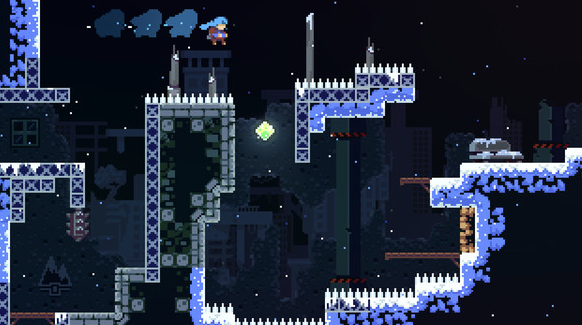
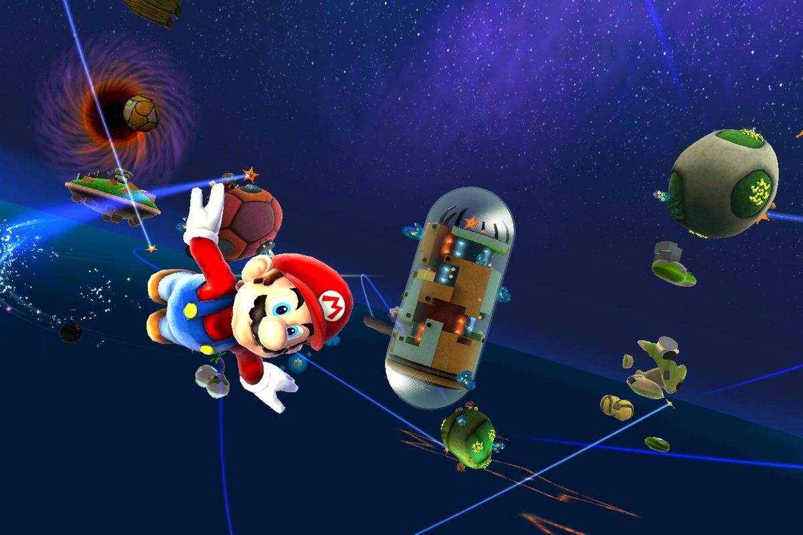
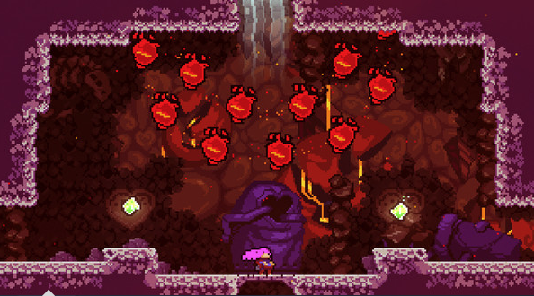
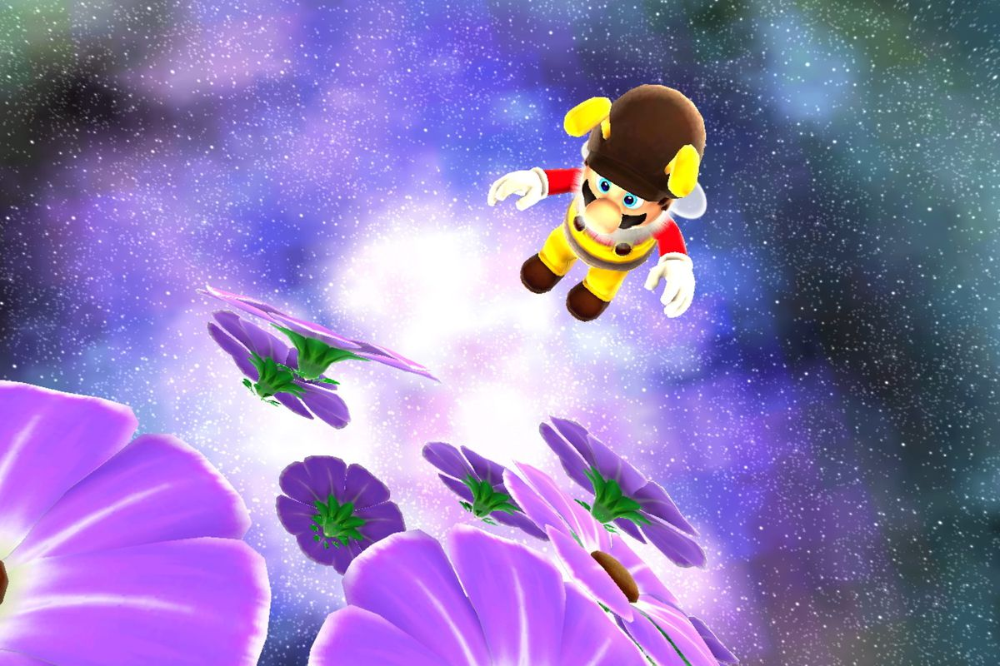
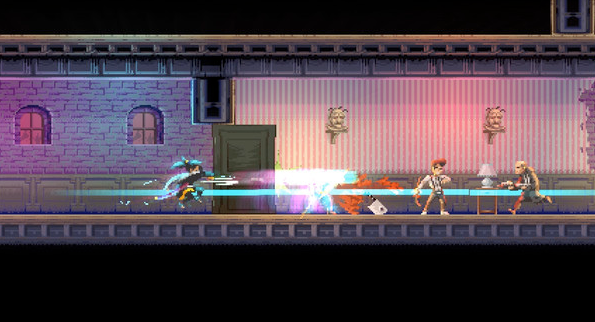

# Game Brainstorming

_Author: @jonschenk_

**_Summary:_**

> Design a game inspired by popular 2D games that already exist. This will be my (Jon's) first attempt at fully fleshing out a game. I have played around with Unity in the past, but this will most likely be done in Godot. Some core values in a game I make will be satisfying movement, a speedrunnable level design, and an aesthetically pleasing world. The biggest challenge I anticipate I will face is the art. I am determined to learn myself how to make the sprites and tilesets, but I will not be ashamed to use assets if necessary in some places.

### General

- platformer
- pixel art
- 2d
- SATISFYING movement

### Inspiration

- Celeste
- Mario (Galaxy / Odyssey life system)

### Movement

- Dashing
  - Jumping + pressing and releasing crouch = dash in direction of mouse/joystick
- Crouching
  - While running, if you crouch, you will slide
- Jumping

### Combat

- hitting enemies' heads mario-style

### Levels / Layout

- Level based
- Start zone -> Checkpoint (optional) -> End zone
- global collectible (like strawberries in celeste)
- End zone is tbd but most likely like a star acts in 3d mario

### Art software options

- Aseprite
  - Will need to learn pixel art skills.
- FL Studio (for music and sfx)
  - Already proficient

### Art ideas

- Background = Space
- Add a pre-background in some areas to simulate cave-type areas.

### Dev software options

- Unity
  - C#
  - Sketchy owners
  - Lots of premade assets and resources in general
- Godot \*
  - GDScript
  - Decent resources to learn things
  - open source
  - free to publish (big bonus)

* Leaning towards using Godot

### Inspiration images

celeste

super mario galaxy

celeste (again)

super mario galaxy (again)

katana zero

# General game design plans

I would like to design a basic 2d mario-like game to learn what I am doing and familiarize myself with the tools and what I should use to accomplish tasks. Once I am familiar with the tools, Expand on the game and add on stretch objectives.

### TODO:

- Learn Godot/Unity (Probably Godot)
- Create basic main character and movements
- Create basic goomba-like enemy
- Create end goal collectible
- Create basic level
- Home screen
  - Play button
  - Show controls
- Art & animations:
  - Main character
  - Enemy
  - Collectibles

### Post-first-iteration goals

- Settings
  - Speedrun timer toggle
  - Keybinds
- More than one level
  - Level selection screen
- Enemy variations
- Strawberry-like collectible
- Hone in designs, better animations

### Stretch goals

- Character customization collectibles
  - Hats
- In-game achievements (Future steam achievements)
  - Achievement log in game
- Controller support
